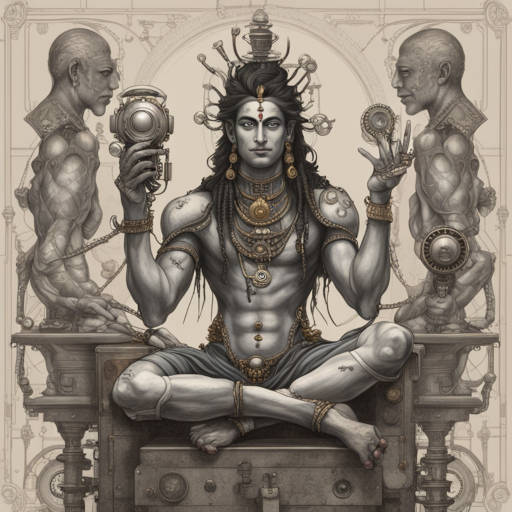
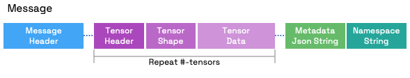
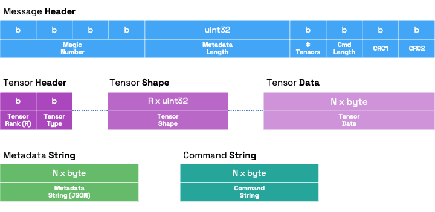

# Shiva




## Table of contents

- [Shiva](#shiva)
  - [Table of contents](#table-of-contents)
  - [Introduction](#introduction)
    - [Message](#message)
    - [Chunks](#chunks)
      - [Magic Number \& CRC](#magic-number--crc)
  - [Data](#data)
    - [Metadata](#metadata)
    - [Namespace (aka. Command)](#namespace-aka-command)
    - [Tensor](#tensor)
  - [Examples](#examples)
  - [:whale2: Docker](#whale2-docker)


## Introduction

### Message

The **Shiva** Message is a binary flow of the following chunks:



The protocol is based on a 'Send Message / Receive Message' flow. For each message sent from the client, the server will respond synchronously with another message. The format of the message is detailed in the following section, the content of the variable part of the message, i.e., tensors/metadata/namespace, is determined by the business logic and can be any data the application requires.

### Chunks

Message chunks are made as follows:



<br>

> :warning: All integers (**uint32**) in headers as well as tensors data are encoded in **big endian** during send and receive.

#### Magic Number & CRC

The magic number serves as a signal lock; it can be valuable in a byte streaming channel to indicate the start of a message. In the current implementation, the magic number is composed of 4 unsigned bytes: `(6, 66, 11, 1)`.

The double CRC at the end of the header is useful for checking and validating the content of the header. Both CRCs are unsigned bytes, and their values are the sum modulo 256 of the preceding numbers. See [python implementation](https://github.com/eyecan-ai/shiva/blob/f4d29ecc9c97ee5984b8128f20c1e2b3f32a98e4/shiva/__init__.py#L151) for an example

## Data

### Metadata

The metadata is a generic JSON string.

### Namespace (aka. Command)

The namespace is a generic string that can be used, for example, to route the message to the right handler.

### Tensor

Each tensor can be a multi-dimensional array of any type. Hence, the tensor has a **rank**, a **shape** and a **type**. The rank is the number of dimensions, the shape is a list of integers, one per dimension, and the type is a string that can be one of the following map:

```
{
    float16: 0,
    float32: 1,
    float64: 2,
    uint8: 3,
    int8: 4,
    uint16: 5,
    int16: 6,
    uint32: 7,
    int32: 8,
    uint64: 9,
    int64: 10,
    double: 11,
    longdouble: 12,
    longlong: 13,
    complex64: 14,
    complex128: 15,
    bool: 17,
}
```

For example a (h,w,c) image of 8-bit unsigned integers will have a rank of 3, a shape of [h,w,c] and a type of 3 (uint8).

## Examples

See [Examples](examples/README.md).


## :whale2: Docker

To build the shiva image:
``` console
cd shiva/
docker build -f dockerfiles/Dockerfile -t shiva:latest .
```

To start a CLI session just run the provided compose:

```console
docker compose -f dockerfiles/docker-compose.cli.yml run --service-ports --rm cli
```